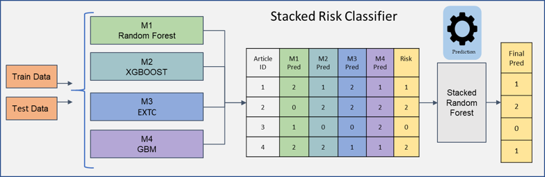

### Sentiment Analysis and Risk Scoring ###

A Natural Language Processing (NLP) model for identifying the risk level of news reported in an article.

**Data:**
1. News articles
2. Stock market data

**Methodology:**

A. Response variable
   1. Calculate sentiment score using the Natural Language Toolkit (NLTK) Python library
   2. Perform Named Entity Recognition (NER) to label companies using spaCy Python Library
   3. Calculate the spread between S&P 500 closing price and the subject firm's closing price 
   4. Label the article as no risk (0), low risk (1) or high risk (2) using the information from step 1-3. This label will serve as the y variable for training the model

B. Feature engineering
   1. Extract dominant topic and topic distribution matrix using Latent Dirichlet Allocation (LDA) from the article
   2. Extract features using a pre-trained Doc2Vec model and convert article into a vector
   3. Run Birch hierarchical clustering algorithm on the vectorized article and assign the cluster label

 C. Modeling
    1. Run the following four machine learning algorithms on the processed article: random forest, extremely randomized tree, gradient boosting, and XGBoost
    2. Feed the output from the four models into a stacked random forest model for final prediction. The pipeline is illustrated in the figure below.
    

**Validation:**

| Risk Classifier | Precision | Recall | F-1 Score | Kappa Score |
| :---: | :---: | :---: | :---: | :---: | 
| Random Forest | 0.71 | 0.70 | 0.68 | 0.43 |
| Extremely Randomized Trees | 0.67 | 0.66 | 0.66 | 0.42 |
| Gradient Boosting | 0.78 | 0.78 | 0.75 | 0.59 |
| XGBoost | 0.74 | 0.75 | 0.72 | 0.58 |
| Ensemble Voting | 0.81 | 0.77 | 0.74 | 0.58 |
| Stacked Model | 0.80 | 0.78 | 0.75 | 0.59 |

Credit and thanks to Saurabh Srivastava and Daniel Tallarico
